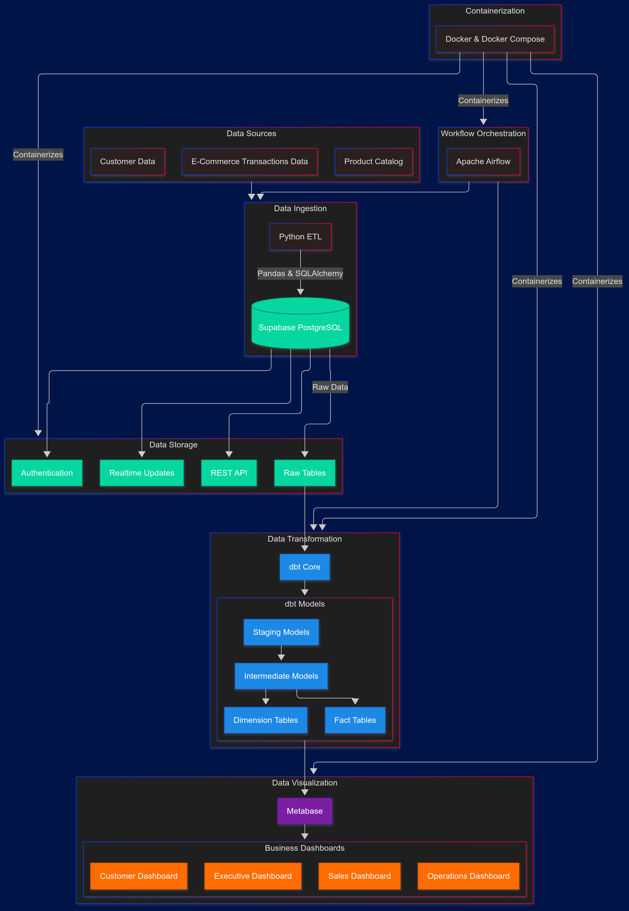

# Supabase E-Commerce Analytics: Open-Source BI with dbt & Metabase

A **fully open-source** business intelligence solution for e-commerce data using **Supabase (PostgreSQL), dbt, and Metabase**.

## Overview

This project showcases an **end-to-end data analytics pipeline** for e-commerce businesses. It leverages **Supabase as a self-hosted PostgreSQL database**, **dbt for data transformations**, and **Metabase for interactive dashboards** to deliver real-time business insights.



## Tech Stack

| **Component**                | **Technology**              | **Why?**                                                   |
| ---------------------------- | --------------------------- | ---------------------------------------------------------- |
| **Database**                 | Supabase (PostgreSQL)       | Managed PostgreSQL with REST APIs & real-time capabilities |
| **ETL & Data Ingestion**     | Python (Pandas, SQLAlchemy) | Automates data loading into Supabase                       |
| **Transformations**          | dbt (Data Build Tool)       | SQL-based modeling, data transformation, and testing       |
| **BI & Dashboards**          | Metabase                    | Open-source business intelligence tool                     |
| **Containerization**         | Docker & Docker Compose     | Simplifies deployment and orchestration                    |
| **Orchestration (Optional)** | Apache Airflow or Prefect   | Automates workflow execution if needed later               |
| **Version Control**          | GitHub                      | Code management & CI/CD workflows                          |

## Features

- **Supabase as Database Backend**: PostgreSQL with REST API, authentication, and real-time capabilities
- **dbt Transformations**: SQL-based analytics engineering with well-structured models
- **Dimensional Modeling**: Proper **star schema** for business intelligence
- **Interactive Dashboards**: Prebuilt Metabase dashboards for actionable insights
- **Fully Open Source**: No licensing costs, completely self-hosted with Docker

## Business Questions Addressed

### Sales Performance Analysis

- What are the sales trends over time?
- Which products and categories drive the most revenue?
- How do sales vary by region and customer segment?

### Customer Behavior Analysis

- What is the customer lifetime value?
- How does customer retention vary over time?
- Which customer segments are most profitable?

### Operational Efficiency

- What is the order fulfillment timeline?
- How efficient is the delivery process?
- Are there bottlenecks in the order processing workflow?

## Prerequisites

- Docker
- Python 3.8+
- dbt Core 1.0+
- Metabase 0.41+

## Project Structure

```
supabase_ecommerce_analytics/
├── .github/                  # CI/CD workflows
├── assets/                   # Static assets like images, logos, etc.
├── src/                      # All source code here
│   ├── data/                 # Sample and test data files
│   ├── etl/                  # Data ingestion scripts
│   │   ├── __init__.py
│   │   ├── loader.py         # Main data loading script
│   │   ├── config.py         # Configuration management
│   │   └── utils.py          # Helper functions
│   ├── dbt_project/          # dbt transformation project
│   │   ├── models/           # dbt models organized by layer
│   │   │   ├── staging/      # One-to-one with source tables
│   │   │   ├── intermediate/ # Business logic layer
│   │   │   └── marts/        # Dimensional models for analytics
│   │   ├── tests/            # Data quality tests
│   │   ├── macros/           # Reusable SQL code
│   │   ├── seeds/            # Static reference data
│   │   ├── snapshots/        # Slowly changing dimensions
│   │   ├── dbt_project.yml   # Project configuration
│   │   └── packages.yml      # External dependencies
│   ├── metabase/             # Metabase configurations and exports
│   │   ├── dashboards/       # Dashboard JSON exports
│   │   └── questions/        # Saved questions exports
│   └── scripts/              # Utility scripts for project management
├── tests/                    # Unit and integration tests
├── venv/                     # Python virtual environment (gitignored)
├── docker/                   # Docker configurations
│   ├── Dockerfile            # Main service Dockerfile
│   └── metabase/             # Metabase specific Docker configs
├── .env.dev                  # Development environment variables
├── .env.example              # Example environment variables (template)
├── .env.prod                 # Production environment variables
├── .gitignore                # Git ignore rules
├── docker-compose.dev.yml    # Development Docker Compose config
├── docker-compose.prod.yml   # Production Docker Compose config
├── README.md                 # Project overview
└── requirements.txt          # Python dependencies
```

## Installation & Setup

### 1️⃣ Start Supabase Services with Docker

```bash
git clone https://github.com/dasdatasensei/supabase_ecommerce_analytics.git
cd supabase_ecommerce_analytics
```

### 2️⃣ Configure dbt to Connect to Supabase

Edit `~/.dbt/profiles.yml`:

```yaml
ecommerce_analytics:
  target: dev
  outputs:
    dev:
      type: postgres
      host: localhost
      user: postgres
      password: yourpassword
      port: 5432
      dbname: postgres
      schema: public
      threads: 4
```

Then test the connection:

```bash
dbt debug
```

### 3️⃣ Set Up Metabase

```bash
# Download Metabase
curl -o metabase.jar https://downloads.metabase.com/latest/metabase.jar

# Run Metabase
java -jar metabase.jar
```

### 4️⃣ Load Data into Supabase

```bash
python data_loader/loader.py
```

### 5️⃣ Run dbt Transformations

```bash
cd dbt_project
dbt run
dbt test
dbt docs generate
dbt docs serve
```

### 6️⃣ Access Metabase Dashboards

Open `http://localhost:3000`, configure the PostgreSQL connection, and import the dashboards from `metabase/dashboards/`.

## Data Models

This project implements a dimensional model (star schema) with the following key models:

### Dimension Tables

- `dim_customers` - Customer attributes and demographics
- `dim_products` - Product details and hierarchies
- `dim_dates` - Calendar date dimensions for time-based analysis
- `dim_locations` - Geographic hierarchies

### Fact Tables

- `fct_orders` - Order header information
- `fct_order_items` - Line-item level transactions
- `fct_payments` - Payment transactions
- `fct_shipping` - Shipping and delivery events

## Dashboards

### **Executive Dashboard**

- Revenue trends
- Customer acquisition costs
- Profit margins
- Geographic performance

### **Sales Analysis Dashboard**

- Product category analysis
- Sales by time period
- Customer segment performance
- Order value distribution

### **Customer Insights Dashboard**

- Customer cohort analysis
- Retention metrics
- Customer lifetime value
- Purchase frequency

### **Operations Dashboard**

- Order fulfillment timelines
- Shipping performance
- Payment method analysis
- Returns and refunds tracking

## Data Loader Implementation

Below is a simplified implementation of the data loader that can import e-commerce data into Supabase:

```python
import pandas as pd
import sqlalchemy
from sqlalchemy.engine import create_engine
import logging
from typing import Dict, List, Optional
import os
from dotenv import load_dotenv

# Configure logging
logging.basicConfig(
    level=logging.INFO,
    format='%(asctime)s - %(name)s - %(levelname)s - %(message)s',
    handlers=[logging.FileHandler("data_loader.log"), logging.StreamHandler()]
)
logger = logging.getLogger(__name__)

class SupabaseDataLoader:
    """Loads E-Commerce dataset into Supabase (PostgreSQL) database."""

    def __init__(self, db_config: Dict[str, str]):
        """
        Initialize the data loader with database configuration.

        Args:
            db_config: Dictionary with database connection parameters
        """
        self.db_config = db_config
        self.engine = None
        self.conn = None

    def connect_to_db(self) -> None:
        """Establish connection to Supabase PostgreSQL database."""
        try:
            connection_string = f"postgresql://{self.db_config['user']}:{self.db_config['password']}@{self.db_config['host']}:{self.db_config['port']}/{self.db_config['database']}"
            self.engine = create_engine(connection_string)
            self.conn = self.engine.connect()
            logger.info("Successfully connected to Supabase PostgreSQL database")
        except Exception as e:
            logger.error(f"Error connecting to database: {e}")
            raise

    def load_csv_to_table(self, csv_path: str, table_name: str, if_exists: str = 'replace') -> None:
        """
        Load CSV data into a Supabase table.

        Args:
            csv_path: Path to the CSV file
            table_name: Name of the target table
            if_exists: Strategy if table exists ('replace', 'append')
        """
        try:
            logger.info(f"Loading data from {csv_path} to table {table_name}")

            # Read CSV file
            df = pd.read_csv(csv_path)

            # Clean column names (lowercase, replace spaces with underscores)
            df.columns = [col.lower().replace(' ', '_') for col in df.columns]

            # Load data directly using pandas to_sql
            df.to_sql(
                name=table_name,
                con=self.engine,
                if_exists=if_exists,
                index=False,
                chunksize=1000  # Process in chunks for large datasets
            )

            # Enable row-level security and set up policies using raw SQL
            with self.engine.begin() as connection:
                # Enable row-level security (RLS) for the table
                connection.execute(sqlalchemy.text(f"ALTER TABLE {table_name} ENABLE ROW LEVEL SECURITY"))

                # Create policy that allows all authenticated users to read
                policy_name = f"{table_name}_read_policy"
                policy_sql = f"""
                CREATE POLICY {policy_name} ON {table_name}
                FOR SELECT USING (auth.role() = 'authenticated')
                """
                connection.execute(sqlalchemy.text(policy_sql))

            logger.info(f"Successfully loaded {len(df)} rows into {table_name}")
        except Exception as e:
            logger.error(f"Error loading data: {e}")
            raise

    def add_supabase_realtime(self, table_name: str) -> None:
        """
        Enable Supabase real-time capabilities for a table.

        Args:
            table_name: The table to enable real-time for
        """
        try:
            with self.engine.begin() as connection:
                # Add the table to the realtime publication
                query = f"""
                BEGIN;

                -- Create the realtime publication if it doesn't exist
                DO $
                BEGIN
                    IF NOT EXISTS (
                        SELECT FROM pg_publication WHERE pubname = 'supabase_realtime'
                    ) THEN
                        CREATE PUBLICATION supabase_realtime;
                    END IF;
                END
                $;

                -- Add the table to the publication
                ALTER PUBLICATION supabase_realtime ADD TABLE {table_name};

                COMMIT;
                """
                connection.execute(sqlalchemy.text(query))

            logger.info(f"Successfully enabled real-time for table {table_name}")
        except Exception as e:
            logger.error(f"Error enabling real-time: {e}")
            raise

    def close_connection(self) -> None:
        """Close database connection."""
        if self.conn:
            self.conn.close()
        if self.engine:
            self.engine.dispose()
        logger.info("Database connection closed")

    def __enter__(self):
        self.connect_to_db()
        return self

    def __exit__(self, exc_type, exc_val, exc_tb):
        self.close_connection()
```

## Extending the Project

### Adding New Data Sources

1. Create a new loader module in `data_loader/sources/`
2. Define source tables in dbt `sources.yml`
3. Create corresponding staging models

### Leveraging Supabase Features

1. **Authentication**: Use Supabase auth for dashboard access control
2. **REST API**: Build custom applications that connect to your analytics
3. **Real-time Updates**: Create live dashboards that update in real-time

### Creating Custom Dashboards

1. Use existing models to build new insights in Metabase
2. Export dashboard definitions to `metabase/dashboards/`

### Implementing Advanced Analytics

1. Add derived metrics in dbt models
2. Implement predictive analytics with dbt Python models

## Troubleshooting

### Common Issues

#### Supabase Connection Failures

- Check Docker container status with `docker ps`
- Verify database credentials in your configuration
- Review logs with `docker logs supabase-db`

#### dbt Transformation Errors

- Run `dbt debug` to verify configuration
- Check for SQL syntax errors in models
- Ensure dependencies are correctly specified

#### Metabase Connection Issues

- Verify Supabase credentials in Metabase admin
- Check network connectivity to Supabase
- Ensure proper permissions for the Metabase database user

## Contributing

1. Fork the repository from https://github.com/dasdatasensei/supabase_ecommerce_analytics.git
2. Create a feature branch: `git checkout -b feature/your-feature`
3. Commit changes: `git commit -am 'Add your feature'`
4. Push to the branch: `git push origin feature/your-feature`
5. Submit a pull request to the main repository

## License

This project is licensed under the MIT License - see the LICENSE file for details.

## Acknowledgments

- [Supabase](https://supabase.com/) for the PostgreSQL-based backend
- [dbt Labs](https://www.getdbt.com/) for dbt Core
- [Metabase](https://www.metabase.com/) for the open-source BI tool

## Data Loading

### Setting up Kaggle API credentials

To download the Brazilian E-commerce dataset from Kaggle, you'll need to:

1. Create a Kaggle account if you don't have one
2. Go to your Kaggle account settings (https://www.kaggle.com/account)
3. Scroll to "API" section and click "Create New API Token"
4. This will download a `kaggle.json` file containing your credentials
5. Copy the credentials to your `.env` file:
   ```
   KAGGLE_USERNAME=your_kaggle_username
   KAGGLE_KEY=your_kaggle_api_key
   ```

### Installing dependencies

```bash
python -m venv venv
source venv/bin/activate  # On Windows: venv\Scripts\activate
pip install -r requirements.txt
```

### Running the data loader

```bash
python src/etl/loader.py
```

The script will:

1. Create a `data/raw` directory if it doesn't exist
2. Download the Brazilian E-commerce dataset
3. Unzip the files automatically
4. Log the process in detail

The downloaded CSV files will be available in the `data/raw` directory.

## Deployment

### Development Environment

```bash
# Clone the repository
git clone https://github.com/dasdatasensei/supabase_ecommerce_analytics.git
cd supabase_ecommerce_analytics

# Set up environment variables
cp .env.example .env.dev
# Edit .env.dev with your development credentials

# Start development services with Docker
make docker-dev

# Install Python dependencies
make setup

# Run dbt models
make dbt-run
```

### Production Deployment

```bash
# Set up production environment variables
cp .env.example .env.prod
# Edit .env.prod with your production credentials (use a secure method for sensitive data)

# Start production services
make docker-prod
```

For cloud deployment, consider:

1. **AWS**:

   - Use ECS for container orchestration
   - RDS for database (or maintain Supabase in EC2)
   - ElastiCache for Redis
   - S3 for backups

2. **GCP**:

   - Use GKE for Kubernetes deployment
   - Cloud SQL for database
   - Memorystore for Redis
   - Cloud Storage for backups

3. **Azure**:
   - Use AKS for Kubernetes deployment
   - Azure Database for PostgreSQL
   - Azure Cache for Redis
   - Blob Storage for backups

## Testing

The project includes comprehensive testing:

```bash
# Run Python tests
python -m pytest tests/

# Run dbt tests
cd src/dbt_project && dbt test
```

## CI/CD Pipeline

This project uses GitHub Actions for continuous integration:

- **Linting**: Ensures code quality with flake8, black, and isort
- **Testing**: Runs Python tests and dbt compilation
- **Deployment**: (Configure this according to your production environment)

## Monitoring

For production monitoring, consider implementing:

1. **Prometheus & Grafana**: For metrics and dashboards
2. **ELK Stack**: For centralized logging
3. **Airflow monitoring**: Built-in Airflow dashboard for DAG monitoring

## Contributing

1. Fork the repository from https://github.com/dasdatasensei/supabase_ecommerce_analytics.git
2. Create a feature branch: `git checkout -b feature/your-feature`
3. Commit changes: `git commit -am 'Add your feature'`
4. Push to the branch: `git push origin feature/your-feature`
5. Submit a pull request to the main repository
